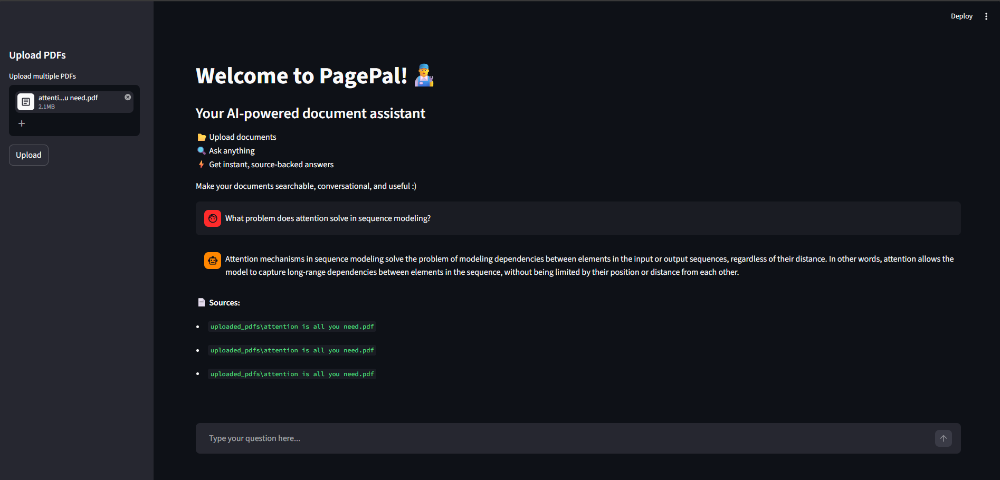

# PagePal
**PagePal** is a RAG-based AI assistant that lets you chat with PDFs and get fast, accurate, context-grounded answers.



## ✨ Features
- Upload and process PDF documents  
- Ask questions in natural language  
- Semantic search using embeddings  
- Fast responses via Groq (LLaMA 3.3 70B)  
- Context-aware answers grounded in documents  
- Persistent vector storage with Chroma  
  
## ⚙️ Tech Stack
| Category        | Tool / Model                                    |
|----------------|-------------------------------------------------|
| 🎨 Frontend     | Streamlit                                       |
| ⚙️ Backend      | FastAPI                                         |
| 🤖 LLM          | Groq (`llama-3.3-70b-versatile`)                |
| 🧬 Embeddings   | sentence-transformers (`all-MiniLM-L12-v2`)      |
| 🗃️ Vector DB    | Chroma                                          |
| 🔗 RAG          | LangChain                                       |
## 🚀 Run Locally

```bash
git clone https://github.com/NamitaBhatta/PagePal.git
cd PagePal
pip install -r requirements.txt
